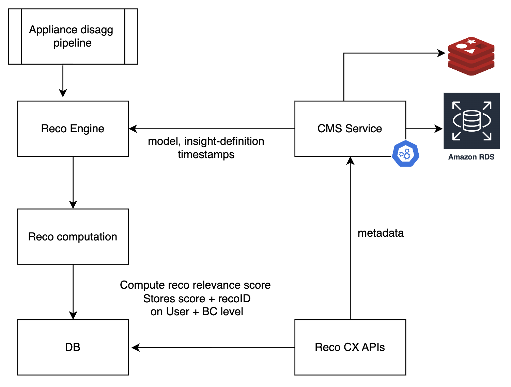
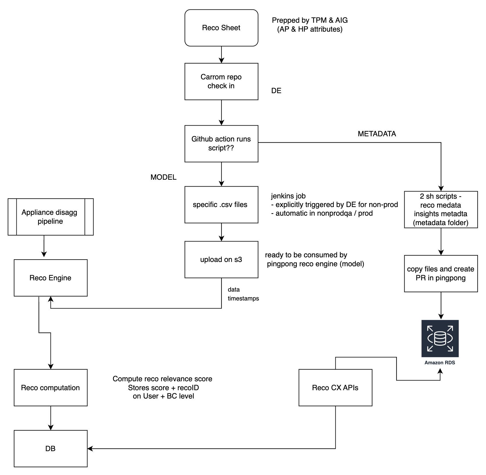

# Content Management

!!! abstract "Confluence"
    - [Confluence 1](https://bidgely.atlassian.net/wiki/pages/viewpage.action?pageId=815431723)
    - [Confluence 2](https://bidgely.atlassian.net/wiki/pages/viewpage.action?pageId=633110556)

## Overview  
The Content Management section of the DETO dashboard lets utilities and Bidgely teams manage every piece of content that lives outside the normal code‑release cycle.  From pilot‑level settings to individual recommendation pages, the CMS provides a single source of truth, a clear review workflow, and real‑time collaboration.  Product managers, customer‑success teams, and enterprise admins can create, edit, publish, and localize content without needing engineering support, while still keeping an audit trail and version history.

The system is pilot‑centric: each pilot (a specific utility or program) has its own content space.  Within that space you can manage home and appliance profiles, recommendation text and media, score thresholds, surveys, and more.  All content is stored in a structured format, can be previewed in the CX product, and is released through a controlled publishing pipeline.

## Key Capabilities  
- **Create, edit, and delete pilots** – set pilot ID, name, and supported locales.  
- **View a pilot’s content dashboard** – see health status, counts, and quick links.  
- **Add or modify recommendations** – rich‑text editor, media uploads, targeting rules, and live preview.  
- **Publish content** – move items through Draft → Pending Review → Approved → Published.  
- **Bulk operations** – copy, move, delete, or publish multiple items at once.  
- **Localization** – switch between locales, edit translated text, and track completion.  
- **Version control** – keep a draft copy, publish a new version, or revert to a previous one.  
- **Color palette management** – view, edit, and test color schemes with a contrast checker.  
- **Data scenario management** – view, edit, and import data scenarios for templates and widgets.  
- **Comments and collaboration** – threaded comments, mentions, and resolve status.  
- **Role‑based permissions** – control who can create, edit, review, or publish content.

## User Guide  

### 1. Create a New Pilot and Access Its Dashboard  
1. From the main menu, click **Projects**.  
2. Click **Create New Project**.  
3. In the wizard, enter a **Pilot ID**, a descriptive **Name**, and choose the **Default Locale**.  
4. Select any additional **Supported Locales**.  
5. Click **Create Project**.  
6. The system opens the new pilot’s **Content Dashboard** automatically.  

### 2. Create and Publish a Recommendation  
1. In the pilot’s dashboard, click **Recommendations**.  
2. Click **Create Recommendation**.  
3. In the editor, enter the title, body text, and upload any media.  
4. Use the **Targeting** panel to set audience rules.  
5. Click **Preview** to see how it will appear in the CX product.  
6. When satisfied, click **Submit for Review**.  
7. A reviewer sees the recommendation, can add comments, and clicks **Approve**.  
8. Finally, click **Publish** to make it live.  

### 3. Perform Bulk Operations on Recommendations  
1. In the **Recommendations** list, check the boxes next to the items you want to act on.  
2. From the bulk‑action toolbar, choose **Copy**, **Move**, **Delete**, or **Publish**.  
3. Confirm the action in the dialog that appears.  
4. The selected items are updated in one step.  

### 4. Localize Content and Manage Versions  
1. Open a content item (e.g., a recommendation).  
2. Click the **Locale** dropdown and select the language you want to edit.  
3. Make your changes; the editor shows only the fields for that locale.  
4. Click **Save Draft** to keep the changes private.  
5. When ready, click **Submit for Review** and follow the review workflow.  
6. After approval, click **Publish**.  
7. To revert, open the **Version History** panel, select a previous version, and click **Revert**.  

### 5. Edit the Color Palette (Optional)  
1. From the main menu, open **Color Palette**.  
2. The palette shows all colors for the current pilot and channel (Digital or Paper).  
3. Click a swatch to edit its hex value or copy it to the clipboard.  
4. To test contrast, click **Contrast Checker**, choose a background color, and click **Save**.  
5. The palette updates immediately.  

## Configuration Options  
- **Pilot Settings** – admins can add or remove supported locales, set default locale, and enable or disable specific content types.  
- **Role‑Based Permissions** – define who can create, edit, review, or publish content.  These settings are managed by system administrators in the **User Management** area.  
- **Localization Settings** – choose which languages are available for each pilot and set translation workflows.  
- **Publishing Rules** – configure automatic approval for certain content types or require manual review.  
- **Audit Trail** – view who made each change and when; this is enabled by default and cannot be disabled.

## Related Features  
- [Recommendations](recommendations.md) – detailed guidance on recommendation content and targeting.  
- [Survey Builder](survey-builder.md) – create and manage surveys that can be linked to pilots.  
- [CX Visual Editor](cx-visual-editor.md) – design and preview CX product pages.  
- [Data Scenarios](data-scenarios.md) – manage data scenarios that drive dynamic content.