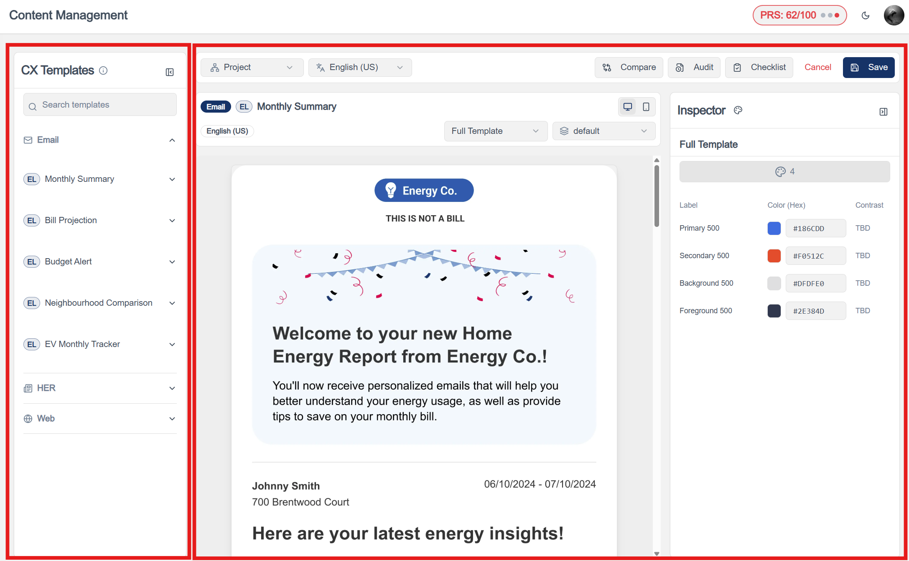
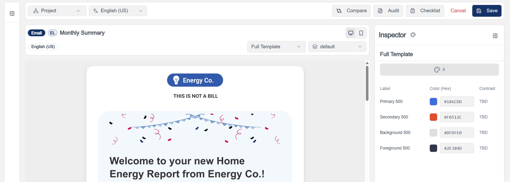

# CX Visual Editor

!!! abstract "Product Specification"
    - [Visual Editor Scope](https://bidgely.atlassian.net/wiki/pages/viewpage.action?pageId=975110165)
    - [Additional Specs 1](https://bidgely.atlassian.net/wiki/pages/viewpage.action?pageId=1039237136)
    - [Additional Specs 2](https://bidgely.atlassian.net/wiki/pages/viewpage.action?pageId=1504018492)
    - [Additional Specs 3](https://bidgely.atlassian.net/wiki/pages/viewpage.action?pageId=1028194310)
    - [Additional Specs 4](https://bidgely.atlassian.net/wiki/pages/viewpage.action?pageId=1079345206)

## Overview
The CX Visual Editor is a WYSIWYG (What-You-See-Is-What-You-Get) templating engine empowering Customer Experience (CX) managers to design, edit, and preview customer-facing content without touching raw code. It bridges the gap between structured backend data and the eventual presentation layer on Web, Email, and Paper interfaces.

## Key Capabilities
- **Drag-and-Drop Interface:** Easily construct emails or digital widgets by dragging predefined content blocks (like charts, text areas, or specific Bidgely insights).
- **Responsive Previews:** Instantly preview how the designed template will render on desktop, tablet, and mobile breakpoints.
- **Dynamic Content Injection:** Seamlessly bind dynamic customer properties (like `billing_cycle`, `savings_percentage`) directly into the text using a variable picker.
- **Brand Theming Inheritance:** Visual templates automatically inherit the overarching theme colors and fonts defined inside the Pilot Configuration mapping.

## User Guide

### 1. Launching the Editor
1. In the CMS interface, navigate to the Content Management module.
2. Select **CX Customization > Visual Templates**.
3. Create a new template or select an existing draft. The main WYSIWYG canvas will initialize.

### 2. Modifying a Layout
1. Use the left-hand sidebar to pull in structural elements (Rows, Columns, Spacers).
2. Drag Bidgely-specific Widgets (e.g., *Bill Projection*, *Similar Home Comparison*) into the layout containers.
3. Use the right-hand **Properties Panel** to adjust padding, borders, text alignments, and conditional display rules.

### 3. Binding Dynamic Tokens
1. Click into a Text Block component.
2. Select the `{}` Token Picker icon from the text formatting toolbar.
3. Select the desired backend variable (e.g., `user.first_name` or `reco.estimated_savings`). The engine will dynamically replace this placeholder at runtime.

## Configuration Options
- **Strict Mode Formatting:** Restrict font choices in the editor to brand-approved weights and sizes.
- **Component Access Rules:** Limit access to complex analytical widgets to advanced CX designers only.

## Related Features
- [Content Management](content-management.md)
- [Recommendations](recommendations.md)
- [Color Management](color-management.md)
