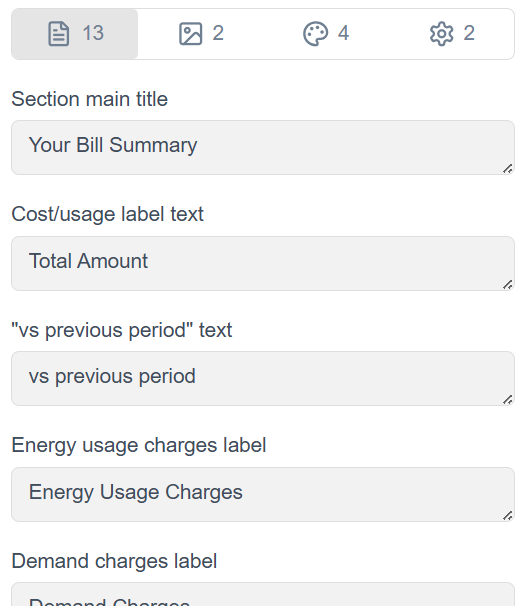

# CX Visual Editor

!!! abstract "Confluence"
    - [Confluence 1](https://bidgely.atlassian.net/wiki/pages/viewpage.action?pageId=975110165)
    - [Confluence 2](https://bidgely.atlassian.net/wiki/pages/viewpage.action?pageId=1039237136)
    - [Confluence 3](https://bidgely.atlassian.net/wiki/pages/viewpage.action?pageId=1504018492)
    - [Confluence 4](https://bidgely.atlassian.net/wiki/pages/viewpage.action?pageId=1028194310)
    - [Confluence 5](https://bidgely.atlassian.net/wiki/pages/viewpage.action?pageId=1079345206)

## Overview

The **CX Visual Editor** is the DETO workspace for reviewing and updating customer-facing communication templates with a live preview. It is designed for teams who manage content across **Email**, **HER / Paper**, **Web**, and **SMS**, and who need to see how changes will actually look before they are approved for use.

You use this area from **Content Management** to select a template, choose the right editing context, update content in the inspector, and review the result in the preview area. The editor supports work at different scopes such as **Project** or **Cluster**, as well as different **Locales**, **Fuel Types**, and **Data Scenarios** so you can validate realistic customer variations.

The feature is especially useful for controlled customization and review. In addition to editing text, images, and metadata, teams can compare variants, track sign-off progress, and review audit history. This helps reduce rework and makes approval workflows clearer for utility teams, Customer Success, and project stakeholders.

## Key Capabilities

- Browse templates by **channel** in the left sidebar.
- Search for a template and narrow the list by **fuel type**.
- Select **Project** or **Cluster** context before making edits.
- Switch **Locale** and **Data Scenario** to preview different customer conditions.
- Preview a **Full Template** or focus on a specific **element/section**.
- Toggle between **Desktop** and **Mobile** preview where supported.
- Edit content in the **Text**, **Images**, and **Metadata** tabs.
- Save changes and immediately review the updated preview.
- Cancel unsaved changes before they are applied.
- Compare two variants side by side using **Compare**.
- Sign off an element or template as part of approval workflow.
- Review progress and accountability through **Checklist** and **Audit**.

## User Guide

### Open the editor and select a template

1. Open **Content Management** and select **CX Visual Editor**.
2. If your project is not already active, choose the correct project context first.
3. In the left **Templates** sidebar, browse templates grouped under **Email**, **HER**, **Web**, or **SMS**.
4. Use the **Search** bar to find a template by name if the list is long.
5. If needed, use the fuel filter to narrow templates to **EL**, **GAS**, or **DF**.
6. Click a template to load it into the editor.
7. If you want more workspace, use the sidebar collapse control. Expand it again when you need to switch templates.

### Set the preview context and review the output

1. After selecting a template, go to the top toolbar and choose the correct **Hierarchy** such as **Project** or **Cluster**.
2. Select the required **Locale**, such as English or Spanish.
3. Choose a **Data Scenario** to preview realistic customer data conditions.
4. In the element selector, choose **Full Template** to review the whole communication, or select a specific section such as **Header**.
5. Use the preview mode control to switch between **Desktop** and **Mobile** when available.
6. Review the center preview area to confirm the content, layout, and personalization look correct.
7. If the preview refreshes, wait for it to finish loading before changing to another scenario or section.

### Edit text, images, or metadata and save changes

1. In the right-side inspector, confirm you are editing the correct **Full Template** or selected element.
2. Open the tab you need:
   - **Text** for copy updates
   - **Images** for image links and previews
   - **Metadata** for behavior or layout settings
3. Update one field at a time. Modified fields are highlighted so you can see what has changed.
4. Watch the preview area as you edit to confirm the result looks right.
5. If a field shows guidance or limits, review that information before saving.
6. Click **Save** to apply your updates for the current hierarchy, locale, and scenario context.
7. If you decide not to keep your edits, click **Cancel** and confirm if prompted.

### Compare two variants side by side

1. Open a template in the editor and set up your primary view.
2. Click **Compare** in the toolbar.
3. In the comparison setup, choose the second variant you want to review. This can differ by template, hierarchy, locale, or scenario.
4. Run the comparison to open a split preview.
5. Review both sides together to check differences in content, localization, or scenario behavior.
6. Use compare mode for before-and-after review, cluster versus project review, or scenario testing.
7. Exit compare mode when you are ready to return to single-template editing.

### Sign off completed work

1. Open the template or element that is ready for review.
2. Confirm the correct **Hierarchy**, **Locale**, and **Data Scenario** are selected so you are approving the right variant.
3. Review the latest preview carefully before approval.
4. In the inspector area, use **Signoff** when the content is complete and approved.
5. Confirm the action if a confirmation message appears.
6. If your role allows it, you can also undo sign-off when further changes are required.
7. Use **Checklist** and **Audit** to track what has been completed and who performed each action.

## Configuration Options

The options you see in the editor depend on your role and the selected template.

- **Hierarchy / Cluster**: Controls whether changes apply broadly at the project level or to a more specific cluster context.
- **Locale**: Lets you edit and review language-specific variants.
- **Data Scenario**: Changes the preview dataset so you can validate realistic customer conditions.
- **Element selector**: Switch between **Full Template** and individual sections.
- **Preview mode**: **Desktop** and **Mobile** are available where the channel supports them.
- **Inspector tabs**:
  - **Text** for copy and labels
  - **Images** for image references and previews
  - **Metadata** for display and behavior settings
- **Save** and **Cancel**: Manage unsaved changes. The editor does not auto-save.
- **Signoff**: Available only to users with approval permissions.
- **Checklist** and **Audit**: Available based on role and workflow setup.

Color management may be handled separately through the dedicated palette workflow rather than directly in this editor. If you do not see an option you expect, configuration is managed by system administrators.

## Related Features

- [Content Management](content-management.md)
- [Data Scenarios](data-scenarios.md)
- [Color Management](color-management.md)
- [Config Registry](config-registry.md)