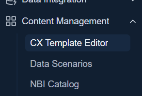
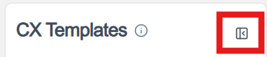

# CX Visual Editor

!!! abstract "Confluence"
    - [Confluence 1](https://bidgely.atlassian.net/wiki/pages/viewpage.action?pageId=975110165)
    - [Confluence 2](https://bidgely.atlassian.net/wiki/pages/viewpage.action?pageId=1039237136)
    - [Confluence 3](https://bidgely.atlassian.net/wiki/pages/viewpage.action?pageId=1504018492)
    - [Confluence 4](https://bidgely.atlassian.net/wiki/pages/viewpage.action?pageId=1028194310)
    - [Confluence 5](https://bidgely.atlassian.net/wiki/pages/viewpage.action?pageId=1079345206)

## Overview  
The CX Visual Editor is a web‑based canvas that lets marketers, product managers, and administrators author and preview Email, HER, and Web templates at the element level. It separates authoring from live rendering, so changes can be tested safely before they go live. The editor supports multiple variants—hierarchy, locale, and scenario—so you can see exactly how a template will look for each audience.  

By editing text, images, colors, and metadata directly in the preview, you can iterate quickly, enforce brand guidelines, and keep a clear audit trail of every change. The editor is part of the broader Content Management experience, but it can be used on its own to fine‑tune templates before they are published.

## Key Capabilities  
- Browse and select templates by channel (Email, HER, Web).  
- Switch between hierarchy, locale, and scenario variants.  
- Edit text, images, colors, and metadata in real time.  
- Preview changes instantly in a sandboxed iframe.  
- Compare two variants side‑by‑side.  
- Sign‑off or lock elements for a variant.  
- View audit trail and compliance checklist.  
- Reset to default or revert overrides.  
- Save or cancel edits for the current variant.  
- Toggle between desktop and mobile preview modes.  

## User Guide  

### Open and Edit a Template  
1. From the **CX Visual Editor** page, click the **Templates Sidebar** to see the list of available templates.  
2. Select a template by clicking its name; the editor loads in the main area.  
3. In the **Editor Toolbar**, choose the desired **Hierarchy**, **Locale**, and **Scenario** from the dropdowns.  
4. Click an element in the preview pane; the **Inspector Panel** opens on the right.  
5. In the **Text** tab, edit the content and watch the preview update after a short debounce.  
6. Use the **Images** tab to replace a picture or copy its URL.  
7. In the **Colors** tab, adjust the hex value or toggle an override; the preview shows contrast warnings if needed.  
8. When finished, click **Save** in the toolbar to persist the changes for the selected variant.  
  

### Compare Two Variants  
1. In the **Editor Toolbar**, click **Compare** to open the **Compare Dialog**.  
2. For **Variant A**, select the template, hierarchy, locale, and scenario.  
3. For **Variant B**, choose a different set of options.  
4. Click **Run Compare**; the editor shows a side‑by‑side diff of the rendered output.  
5. Review differences, then close the dialog or adjust variants as needed.  
  

## Configuration Options  
The CX Visual Editor’s settings—such as available locales, scenarios, and user permissions—are managed by system administrators through the **Content Management** configuration portal. Users with editor rights can access the editor but cannot change these global options.

## Related Features  
- [Content Management](content-management.md)  
- [Recommendations](recommendations.md)  
- [Survey Builder](survey-builder.md)  
- [Workflow Engine](workflow-engine.md)