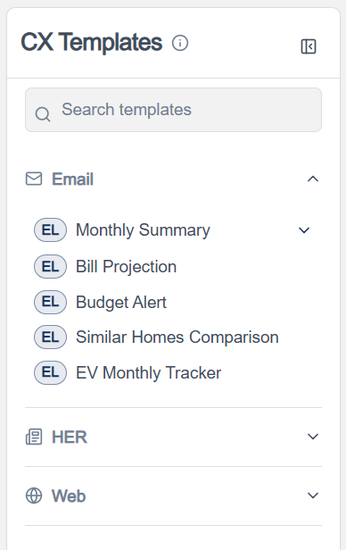
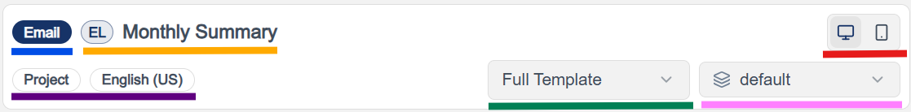
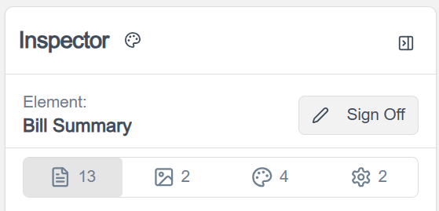
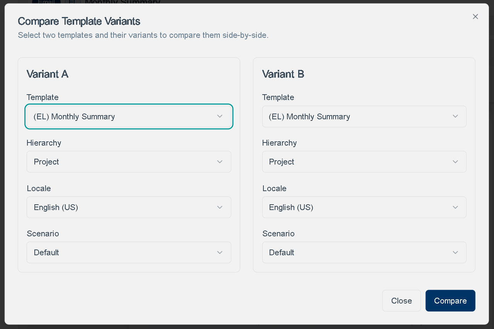
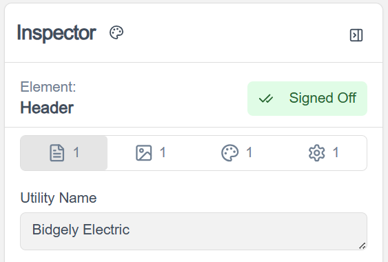

# CX Visual Editor

!!! abstract "Confluence"
    - [Confluence 1](https://bidgely.atlassian.net/wiki/pages/viewpage.action?pageId=975110165)
    - [Confluence 2](https://bidgely.atlassian.net/wiki/pages/viewpage.action?pageId=1039237136)
    - [Confluence 3](https://bidgely.atlassian.net/wiki/pages/viewpage.action?pageId=1504018492)
    - [Confluence 4](https://bidgely.atlassian.net/wiki/pages/viewpage.action?pageId=1028194310)
    - [Confluence 5](https://bidgely.atlassian.net/wiki/pages/viewpage.action?pageId=1079345206)

## Overview

The **CX Visual Editor** is the visual editing workspace in **Content Management** where teams customize customer-facing communications and preview the result before launch. It is designed for business users who need to update content safely across **Email**, **HER**, **Web**, and in some cases **SMS**, without relying on static mockups or separate review files.

You use this area to select a template, choose the right editing context such as **Project** or **Cluster**, switch to the correct **locale** and **scenario**, and then make updates in the **Inspector** while watching the **Preview** refresh. This helps teams validate branding, copy, images, and display behavior in a production-aligned view.

The feature also supports governance workflows. Teams can compare variants side by side, track progress through sign-off and checklist-style review, and use audit history to understand what changed, who changed it, and when. For utilities and delivery teams, this reduces rework and makes review cycles faster and more reliable.

## Key Capabilities

- Browse templates by channel in the left sidebar: **Email**, **HER**, **Web**, and applicable **SMS**
- Search for templates and narrow the list by **fuel type**
- Select **Full Template** or a specific section/element to edit
- Choose the active **Hierarchy**, **Locale**, and **Scenario** before making changes
- Preview content in **Desktop** or **Mobile** mode where supported
- Edit **Text**, **Images**, **Colors**, and **Metadata** from the **Inspector**
- See changes reflected in the preview as you work
- Track unsaved changes and save them with **Save**
- Discard pending edits with **Cancel**
- Compare two variants side by side using **Compare**
- Sign off on content after review and undo sign-off when needed
- Review progress and change history through **Checklist** and **Audit**

## User Guide

### Open the editor and select a template

1. In DETO, open **Content Management** and select **CX Visual Editor**.
2. If your workspace supports multiple projects, confirm you are in the correct project before editing.
3. In the left **Templates** sidebar, browse by channel such as **Email**, **HER**, or **Web**.
4. Use the **Search** bar if you already know the template name.
5. If needed, use the fuel filter to narrow the list to **EL**, **GAS**, or **DF** templates.
6. Click a template to load it into the editor.
7. If you need more room for previewing, collapse the left sidebar and reopen it when needed.

### Choose the right editing context and preview setup

1. After selecting a template, go to the top toolbar.
2. Choose the correct **Hierarchy Selector**, such as **Project** or the appropriate **Cluster**.
3. Select the required **Locale**, such as **en_US** or **es_US**.
4. Choose a **Scenario** so the preview reflects the customer conditions you want to test.
5. Use the **Element/Section Selector** to switch between **Full Template** and a specific section.
6. Select **Desktop** or **Mobile** preview mode. Note that some channels, such as **HER**, may not support mobile preview.
7. Review the badges in the preview toolbar to confirm you are looking at the correct channel, template, locale, and configuration level.

### Edit content in the Inspector and save changes

1. In the right-side **Inspector**, select the tab you want to update: **Text**, **Images**, **Colors**, or **Metadata**.
2. For copy changes, open **Text** and update the fields you need. Modified fields are highlighted so you can see what changed.
3. For image updates, open **Images**, review the current asset, and use the available controls to replace or preview it.
4. For display settings, open **Metadata** and adjust the relevant options carefully, since these can change layout or visibility.
5. Watch the center preview as you work to confirm the result looks correct.
6. When you are satisfied, click **Save**. If the button shows a count, that count reflects your unsaved changes.
7. If you decide not to keep your edits, click **Cancel** to discard them.
8. Before leaving the page or switching templates, make sure you save. There is no auto-save.

### Compare two variants side by side

1. Open a template in **CX Visual Editor**.
2. Set up the first view using the current **Hierarchy**, **Locale**, **Scenario**, and template selection.
3. Click **Compare** in the toolbar.
4. In the comparison setup, choose the second variant you want to review. This can differ by template, hierarchy, locale, or scenario.
5. Run the comparison to open the split preview.
6. Review both sides together to check differences in localization, cluster overrides, or scenario-based rendering.
7. Exit compare mode when you are done and return to the single-template editing view.

### Sign off on reviewed content

1. Open the template or section that is ready for review completion.
2. Confirm you are in the correct **Hierarchy**, **Locale**, and **Scenario**, because sign-off applies to the current variant.
3. Review the preview one final time and confirm all required edits are saved.
4. In the **Inspector**, click **Signoff**.
5. Review the confirmation prompt and continue if the content is approved.
6. After sign-off, the item is treated as approved and may be locked from further editing.
7. If changes are needed later, use the available undo sign-off option to unlock the item again.
8. Use **Audit** and **Checklist** to confirm review progress and approval status.

## Configuration Options

- **Hierarchy Selector** controls where your changes apply, such as **Project** or **Cluster**. Choose this carefully before editing to avoid creating changes at the wrong level.
- **Locale Selector** controls which language version you are editing and previewing.
- **Scenario Selector** changes the preview data so you can test how the same template behaves for different customer situations.
- **Element/Section Selector** lets you edit either the whole template or a specific section.
- **Preview Mode** lets you switch between **Desktop** and **Mobile** where supported by the selected channel.
- **Fuel filters** help narrow the template list by utility context.
- **Sign-off**, **Audit**, and **Checklist** visibility may depend on your role.
- **Color management** may be handled through a separate palette screen in **Content Management**, depending on how your project is configured.
- If you cannot edit a field, save changes, or sign off content, access is likely controlled by role permissions. Configuration is managed by system administrators.

## Related Features

- [Content Management](content-management.md)
- [Color Management](color-management.md)
- [Data Scenarios](data-scenarios.md)
- [Config Registry](config-registry.md)