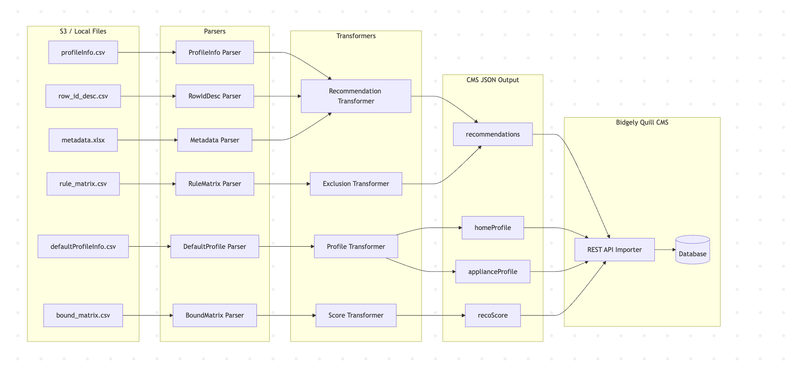

# Data Migration

!!! abstract "Product Specification"
    - [Migration Spec 1](https://bidgely.atlassian.net/wiki/pages/viewpage.action?pageId=1208811597)
    - [Migration Spec 2](https://bidgely.atlassian.net/wiki/pages/viewpage.action?pageId=1224310787)

## Overview
Data Migration is a suite of tools and processes for transforming legacy CSV formats (e.g., from old Pingpong/Carrom systems) into the modernized Bidgely Quill CMS structures. It is primarily used during the transition phase of existing utilities to the new Delivery Console platforms, ensuring that existing configurations, surveys, or recommendations seamlessly port over.

## Key Capabilities
- **Bulk Migration Scripts:** Turn-key CLI tools capable of extracting, mapping, and uploading legacy records at scale into active Environments.
- **Audit Reports:** Generates logs detailing translation errors (e.g., missing API keys or unrecognized identifiers).
- **Format Translation:** Parses legacy flat files and re-structures them into JSON manifests natively understood by the `job-manifest` and `migration` API edges.

## User Guide

### 1. Preparing the Source Data
1. Export the legacy CSV datasets from the old CMS or environment DB.
2. Structure the CSVs into directories matching the entity types (e.g., `sample1/`).
3. Note your new Environment's **Pilot ID** and **API URL**.

### 2. Running a Dry Run
Before invoking the migration over live data endpoints, validate your schema translations locally.
1. Run the migration script with `--dry-run`:
   `npx tsx scripts/migration/migrate.ts --dir sample1 --token YOUR_TOKEN --pilotId 10037 --url http://localhost:1337 --dry-run`
2. Analyze the generated `cms-data.json` local artifact to confirm field mappings are correct.

### 3. Full Deployment
1. Execute the migration script against the live destination environment without `--dry-run`.
2. Monitor the API logs for 201 Created responses confirming successful backend hydration.

## Related Features
- [Environment Management](environment-management.md)
- [Project Management](project-management.md)