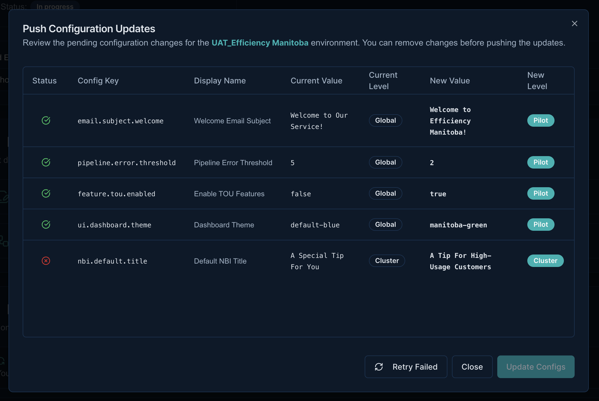
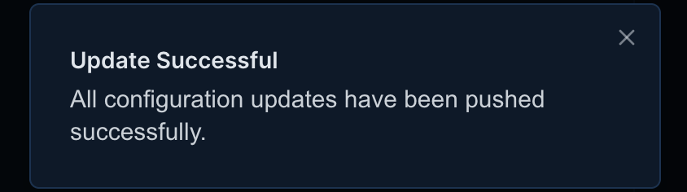

# Project Management

!!! abstract "Confluence"
    - [Confluence 1](https://bidgely.atlassian.net/wiki/pages/viewpage.action?pageId=847642630)
    - [Confluence 2](https://bidgely.atlassian.net/wiki/pages/viewpage.action?pageId=853245955)
    - [Confluence 3](https://bidgely.atlassian.net/wiki/pages/viewpage.action?pageId=853475347)
    - [Confluence 4](https://bidgely.atlassian.net/wiki/pages/viewpage.action?pageId=852557844)

## Overview  
The DETO web application gives delivery teams a single, unified dashboard to create, manage, and monitor projects for energy utilities.  From the Projects Dashboard you can launch a wizard that provisions all the required cloud resources in one click, view detailed project metadata, and push configuration changes to the pilot environment.  The interface is designed for Delivery Engineers, Product Managers, and Customer Success teams, so you can focus on business logic rather than infrastructure.

## Key Capabilities  
- **Create new projects** with a guided wizard that sets up utilities, environments, and ingestion pipelines.  
- **Edit project attributes** (name, description, image, language, time zone).  
- **Configure ingestion** parameters for customer type, fuel, meter, and data source.  
- **View project environments** (UAT, Prod, Dev, Non‑Prod) and their status.  
- **Push configuration updates** to a selected environment with a confirmation step.  
- **Track environment creation status** in real time while provisioning.  
- **Navigate between project details, setup, and status pages** from the dashboard.  
- **Access related tools** such as Recommendations, Survey Builder, and Content Management.

## User Guide  

### Create a New Project  
1. Open the **Projects Dashboard** and click the **Create New Project** button.  
     
2. In the wizard’s first step, select a **Utility** or click **Create New Utility** to add one.  
     
3. Choose an **Environment**: either use an existing one or click **Create New Environment** and pick an AWS region.  
4. In the second step, fill in the **Core Attributes** such as Project ID, Name, Description, Image URL, Language, Country, and Timezone.  
     
5. In the final step, set the **Ingestion Configuration** – customer type, fuel type, meter type, and data source.  
     
6. Review the summary and click **Submit Project Request** to provision the infrastructure.  
     

### View and Edit Project Details  
1. From the dashboard, click **Open Project** on the desired project card.  
     
2. The **Project Attributes** section shows the current name, description, image, and other metadata.  
3. To change any attribute, click the **Edit** icon next to the field, update the value, and click **Save**.  
4. Scroll down to the **Project Environments** list to see UAT, Prod, Dev, and Non‑Prod environments and their current status.  
     
5. Switch to the **Project Setup** tab to adjust ingestion or other configuration settings.  
     
6. After making changes, click **Save** to persist the updates locally.  

### Push Configuration Updates  
1. In the **Project Configs** section, modify any setting you need to change.  
     
2. Click the **Push Updates** button to apply the changes to the pilot environment.  
     
3. A confirmation dialog appears listing the pending changes. Review the list.  
     
4. Click **Confirm** to start the push.  
     
5. After the push completes, a result dialog shows the status of each configuration item.  
     

## Configuration Options  
Project‑level configuration is controlled by the DETO system administrators.  Delivery teams can request changes through the dashboard, but any global settings (e.g., default ingestion parameters, environment templates, or cluster‑wide overrides) are managed by the admin console and not directly editable in the wizard.

## Related Features  
- [Recommendations](recommendations.md)  
- [Survey Builder](survey-builder.md)  
- [Content Management](content-management.md)