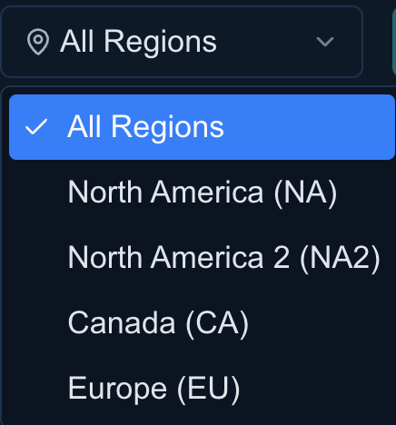
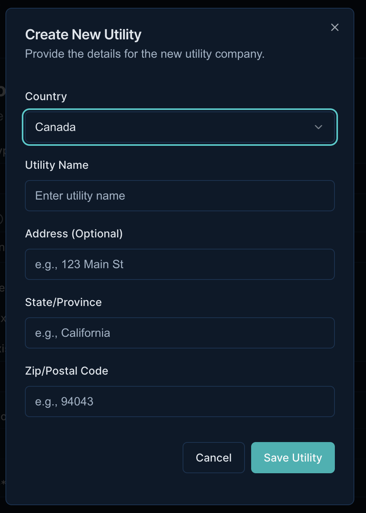
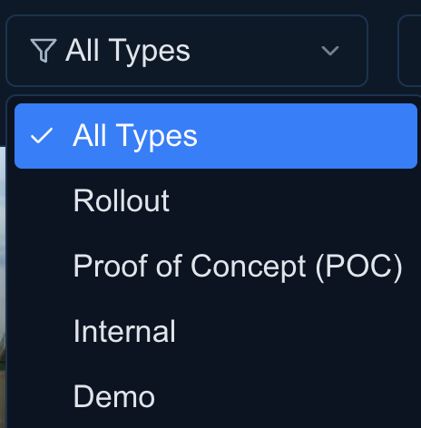
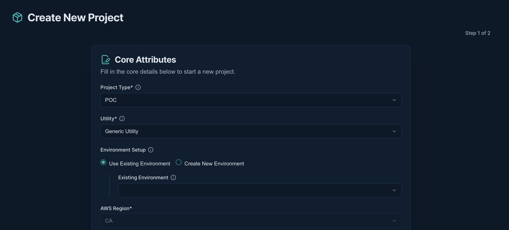
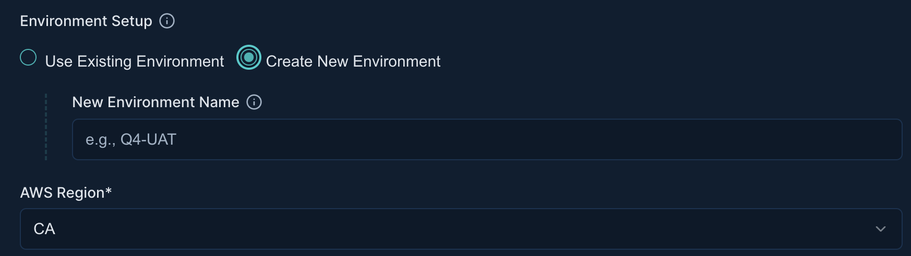
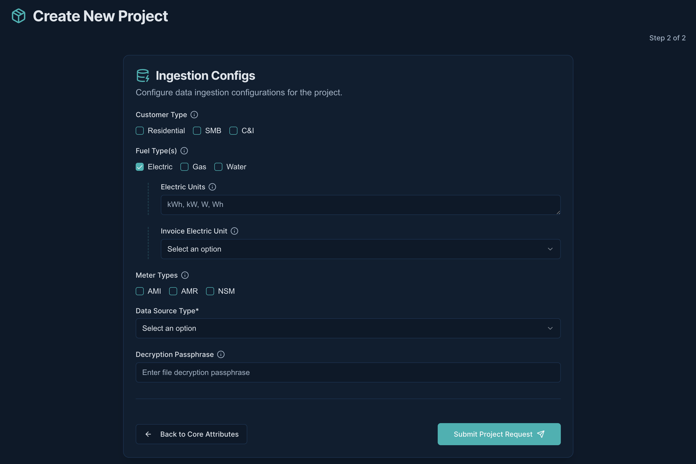

# Project Management

!!! abstract "Confluence"
    - [Confluence 1](https://bidgely.atlassian.net/wiki/pages/viewpage.action?pageId=847642630)
    - [Confluence 2](https://bidgely.atlassian.net/wiki/pages/viewpage.action?pageId=853245955)
    - [Confluence 3](https://bidgely.atlassian.net/wiki/pages/viewpage.action?pageId=853475347)
    - [Confluence 4](https://bidgely.atlassian.net/wiki/pages/viewpage.action?pageId=852557844)

## Overview  
DETO’s Project Management area is the central hub where utilities and delivery teams can create, configure, and monitor projects that power energy‑usage analytics. It gives a single, guided interface for spinning up a new project, linking it to a utility and environment, and setting up the data ingestion pipeline. The result is a consistent, auditable baseline that reduces manual setup time and keeps stakeholders confident that every project follows the same configuration standards.

The feature is designed for Delivery Engineers, Project Managers, Customer Success teams, and Admins. It lets them quickly onboard new utilities, manage existing projects, and keep data pipelines running smoothly without needing to touch backend code.

## Key Capabilities  
- **Create a new project** with a step‑by‑step wizard.  
- **Edit project metadata** (name, description, image, language, timezone).  
- **Create a new environment** and trigger 1‑click cloud provisioning.  
- **Create a new utility** and link it to an environment.  
- **Configure ingestion settings** (customer type, fuel types, meter types, data source).  
- **Filter and search projects** by type, region, or name.  
- **View project details** and status dashboards.  
- **Monitor environment creation** and ingestion progress.  
- **Publish or approve projects** for production use.  
- **Manage project ownership** and audit trails.  

## User Guide  

### Create a New Project  
1. Open the **Projects Dashboard** from the main menu.  
2. Click **Create New Project**.  
3. In the wizard, choose an existing **Utility** or click **Create New Utility**.  
4. Select an existing **Environment** or click **Create New Environment**.  
5. Fill in the **Core Attributes**: Project ID, name, description, image URL, language, country, and timezone.  
6. Configure **Ingestion Settings**: pick customer types, fuel types, meter types, and data source (S3 or SFTP).  
7. Review the summary and click **Submit Project Request**.  
8. The system will create the utility (if new), provision the environment, and apply default ingestion configs.  

### View and Edit Project Details  
1. From the **Projects Dashboard**, click **Open Project** on the card you want to edit.  
2. The **Project Details** page shows all core attributes and ingestion settings.  
3. To edit a field, click the **Edit** icon next to it, make changes, and click **Save**.  
4. For bulk changes, edit the values and click **Save All** at the bottom.  
5. After saving, the page refreshes to show the updated data.  

### Create a New Environment  
1. While creating or editing a project, click **Create New Environment**.  
2. Enter the **Environment name**, select the **Utility**, and add an optional description.  
3. Choose the **AWS Region** from the dropdown.  
4. Click **Create Environment**.  
5. The system automatically provisions the cloud stack; you’ll see a progress bar.  
6. Once completed, the environment appears in the project’s environment list.  

### Create a New Utility  
1. In the project wizard, click **Create New Utility**.  
2. Fill in the **Utility Name**, **Country**, **Address**, **State/Province**, and **Zip/Postal Code**.  
3. Click **Save Utility**.  
4. The new utility is linked to the selected environment automatically.  

### Configure Ingestion Settings  
1. On the **Project Details** page, open the **Ingestion Configuration** section.  
2. Select **Customer Type** (Residential, SMB, C&I).  
3. Choose one or more **Fuel Types** (Electric, Gas, Water).  
4. For each fuel, set the **Fuel Type Units** and **Invoice Fuel Type Units**.  
5. Pick **Meter Types** (AMI, AMR, NSM).  
6. Choose **Data Source Type** (S3 or SFTP).  
   - If **SFTP**, provide **User**, **Password**, **Host Name**, and **Decryption Pathphrase**.  
7. Click **Save** to apply the configuration.  

### Monitor Environment Creation Status  
1. After creating an environment, navigate to the **Environment Creation Status** page.  
2. A progress bar shows the current state (In‑progress, Completed, Failed).  
3. Click **Refresh** to pull the latest status.  
4. If the process is still running, the page will auto‑refresh every minute.  
5. Once completed, the status turns **Completed** and the environment becomes active.  

## Configuration Options  
Project‑level settings such as supported languages, time zones, and default ingestion templates are managed by system administrators. Delivery Engineers can only modify the values presented in the wizard and detail pages. If you need to change global defaults, contact your Admin or use the **Config Registry** feature.

## Related Features  
- [Project Management](project-management.md) – Overview of project lifecycle.  
- [Recommendations](recommendations.md) – Configure recommendation engines for projects.  
- [Survey Builder](survey-builder.md) – Create and manage customer surveys.  
- [CX Visual Editor](cx-visual-editor.md) – Design customer experience flows.