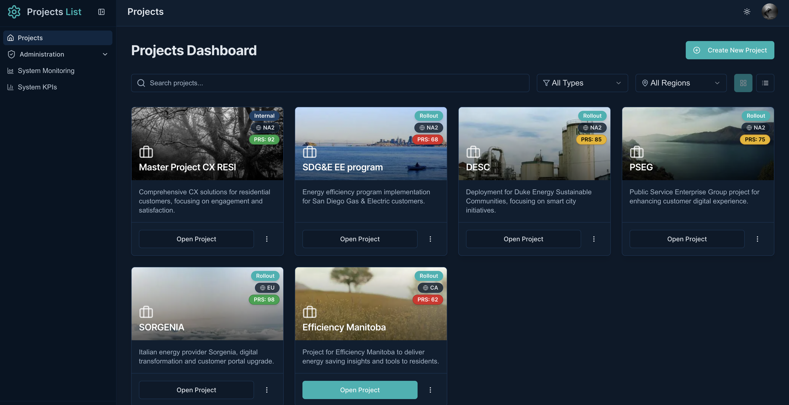
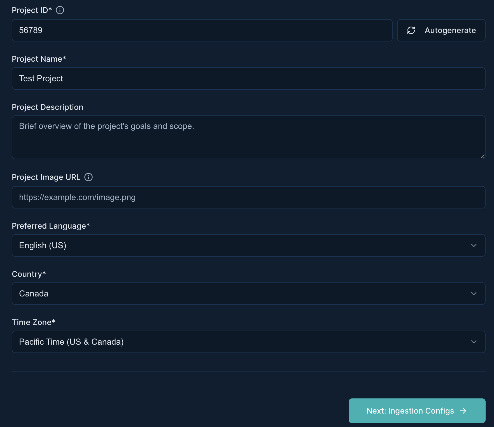
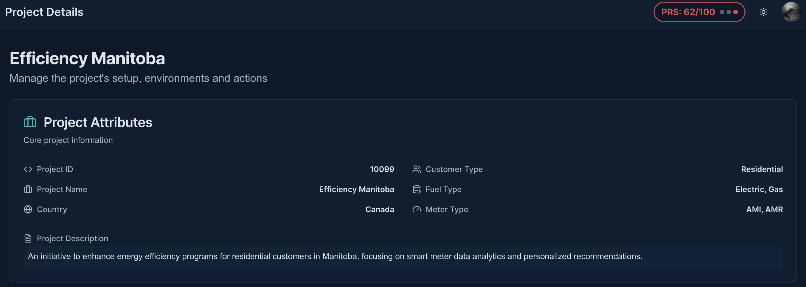
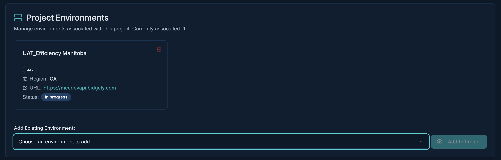
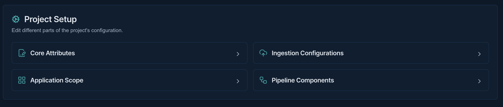
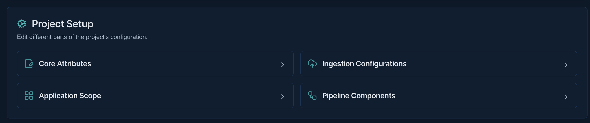
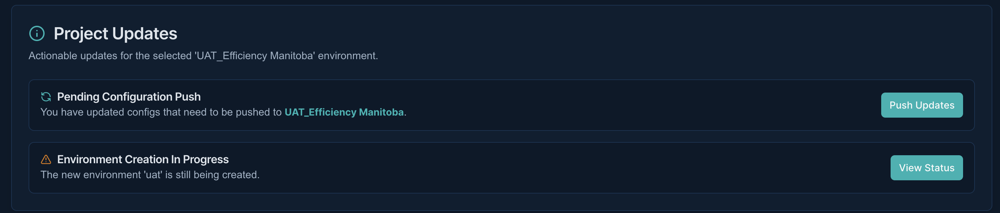
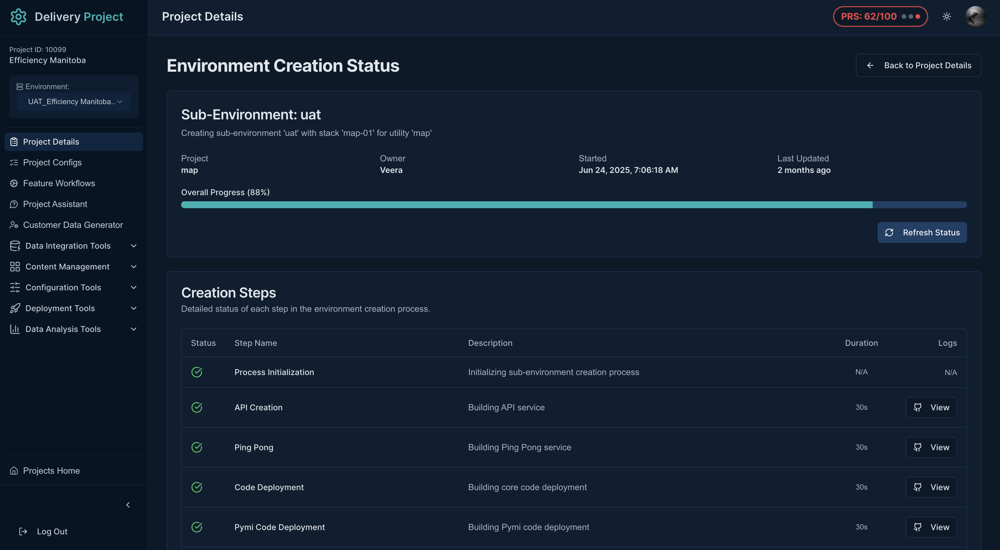

# Project Management

!!! abstract "Confluence"
    - [Confluence 1](https://bidgely.atlassian.net/wiki/pages/viewpage.action?pageId=847642630)
    - [Confluence 2](https://bidgely.atlassian.net/wiki/pages/viewpage.action?pageId=853245955)
    - [Confluence 3](https://bidgely.atlassian.net/wiki/pages/viewpage.action?pageId=853475347)
    - [Confluence 4](https://bidgely.atlassian.net/wiki/pages/viewpage.action?pageId=852557844)
    - [Confluence 5](https://bidgely.atlassian.net/wiki/pages/viewpage.action?pageId=853243345)

## Overview

Project Management in DETO helps delivery teams create, organize, and maintain customer projects from initial setup through ongoing updates. It brings together the key business objects used in Delivery Console—**Utility**, **Environment**, and **Project**—so you can stand up a new customer setup with a guided flow instead of managing each part separately.

This area is most useful for Delivery Engineers, Product Managers, Customer Success teams, and Enterprise Admins who need visibility into project setup and status. You can start from the **Projects Dashboard**, create a new project with required business and ingestion details, review project information on **Project Details**, manage setup sections such as **Pipeline Components** and **Application Scope**, and track provisioning progress through **Environment Creation Status**.

A key benefit of this feature is that project setup is staged and controlled. You can enter project information, rely on default setup where supported, review changes before applying them, and monitor whether a new environment is still **Inprogress** or ready for use.

## Key Capabilities

- View all projects from the **Projects Dashboard** in recent-first order.
- Search and filter projects by name, **Project Type**, and **Region**.
- Start **Create new Project** from the dashboard.
- Create or select a **Utility** during project setup.
- Choose **Use Existing Environment** or **Create new Environment** in the project wizard.
- Enter **Core attributes Information** such as project name, description, language, country, and timezone.
- Use **Autogenerate** to assign a region-based 5-digit **Project ID**.
- Configure **Ingestion Configuration Information** including customer type, fuel type, units, meter type, and data source.
- Review project information and mapped environments on **Project Details**.
- Manage post-creation setup in **Core Attributes**, **Ingestion Configs**, **Pipeline Components**, and **Application Scope**.
- Use **Push Updates** to review and apply saved configuration changes to the target environment.
- Track provisioning progress in **Environment Creation Status** and refresh to see the latest status.

## User Guide

### Create a new project

1. Open **Projects** from the main navigation to reach the **Projects Dashboard**.
2. Review the project cards, or use search and filters to narrow the list by project name, **Project Type**, or **Region**.
3. Click **Create new Project** to open the **Project Creation** wizard.
4. In the first step, choose the **Project Type** and then select an existing **Utility** or create a new one inline.
5. Decide whether to **Use Existing Environment** or **Create new Environment**. If you use an existing environment, the **AWS Region** is filled in automatically and cannot be changed.
6. If you create a new utility, enter the required utility details such as **Country** and **Utility Name**, then continue.
7. Move to the next step to complete **Core attributes Information** and **Ingestion Configuration Information**.
8. When all required fields are complete, click **Submit Project Request**.

### Complete core attributes and ingestion settings

1. In **Core attributes Information**, enter or confirm the **Project ID**. If you do not have one, click **Autogenerate**.
2. Enter the **Project Name**, **Project Description**, and **Project Image URL**.
3. Select the **Preferred Language** and **Country**.
4. Choose the **Timezone** based on the selected country.
5. In **Ingestion Configuration Information**, select one or more **Customer Type** values such as **Residential**, **SMB**, or **C&I**.
6. Select the required **Fuel Type** values. For each fuel selected, choose both the standard unit and invoice unit from the available lists.
7. Select the applicable **Meter Type** and then choose the **Data Source Type**.
8. If you select **SFTP**, complete the additional connection fields shown on the form. Then review the page and click **Submit Project Request**.

### Review project details and environment mapping

1. Open **Project Details** for the project you want to manage.
2. In **Project Attributes**, review the core information such as **Project ID**, **Project Name**, **Country**, **Customer Type**, **Fuel Type**, and **Meter Type**.
3. In **Project Environments**, use the environment selector to view mapped environments for the same project.
4. Confirm the environment details shown, including environment type such as **UAT**, **Prod**, **Non-Prod**, or **Dev**, along with region, URL, and status.
5. If your role allows it, open the setup sections under **Project Setup** to continue configuration.
6. Use these sections to review or update **Core Attributes**, **Ingestion Configs**, **Pipeline Components**, and **Application Scope** as needed.

### Configure pipeline components and application scope

1. From **Project Details**, open **Pipeline Components** to manage project processing and content-related setup.
2. Review the categories shown, such as **Core Processing**, **Content Features**, and **Advanced Features**.
3. Enable or disable the components that are available for this project. Some options appear only when they apply to the project’s customer, fuel, meter, or product setup.
4. Where a file upload is offered, add a replacement file only if you want to override the default resource already provided.
5. Save your changes before leaving the page.
6. Next, open **Application Scope** from the project area.
7. Expand an application category, review the available features, and use the toggles to enable or disable items by fuel type where applicable.
8. Click **Save** to keep your changes.

### Push updates and track environment creation status

1. After making changes in project setup areas, return to **Project Details**.
2. Open **Push Updates** or the pending push area for the selected project.
3. Review the **confirmation popup**, which lists all configuration changes since the last successful push.
4. Confirm the changes only after you are satisfied with the review.
5. Wait for the result message to show which updates succeeded and which failed.
6. If any items fail, use **retry Failed** where available.
7. To monitor a newly created environment, open **Environment Creation Status** from the project area.
8. Review the current status and refresh the page to see the latest provisioning progress.

## Configuration Options

Project Management includes a mix of editable and read-only settings.

- **Editable during project creation:** **Project Type**, utility selection or creation, environment choice, core project details, and ingestion settings.
- **Usually read-only after creation:** **Utility**, environment setup choices, **AWS Region**, and **Project ID**.
- **Editable after creation:** selected fields in **Core Attributes**, parts of **Ingestion Configs**, **Pipeline Components**, and **Application Scope**.
- **Conditional fields:** unit fields appear based on selected **Fuel Type**; SFTP fields appear only when **Data Source Type** is **SFTP**.
- **Visibility by role:** access to setup sections is controlled by **RBAC**. Users only see sections they are permitted to use.
- **Applicability rules:** some pipeline and application options are shown only when they match the project’s customer, fuel, meter, and product context.

If you do not see a section or cannot edit a field, configuration is likely managed by system administrators or restricted by your role.

## Related Features

- [Application Scope](project-management.md)
- [Recommendations](recommendations.md)
- [Content Management](content-management.md)
- [Environment Management](environment-management.md)