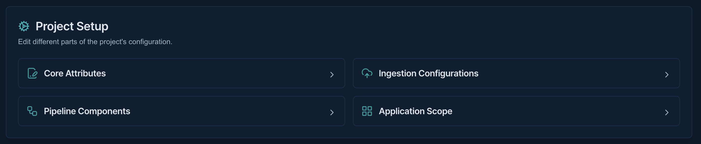

# Project Management

!!! abstract "Confluence"
    - [Confluence 1](https://bidgely.atlassian.net/wiki/pages/viewpage.action?pageId=847642630)
    - [Confluence 2](https://bidgely.atlassian.net/wiki/pages/viewpage.action?pageId=853245955)
    - [Confluence 3](https://bidgely.atlassian.net/wiki/pages/viewpage.action?pageId=853475347)
    - [Confluence 4](https://bidgely.atlassian.net/wiki/pages/viewpage.action?pageId=852557844)
    - [Confluence 5](https://bidgely.atlassian.net/wiki/pages/viewpage.action?pageId=853243345)

## Overview

Project Management in DETO helps delivery teams create, review, and maintain customer projects from one place. It brings together the full project lifecycle: finding projects on the **Projects Dashboard**, creating a new project through a guided wizard, reviewing setup details on **Project Details**, and managing follow-up work such as environment mapping, pipeline setup, application enablement, and configuration pushes.

This area is especially useful for Delivery Engineers, Product Managers, Customer Success teams, and Enterprise Admins who need a clear view of how a project is set up and where it is deployed. The experience is designed to reduce manual setup, keep onboarding consistent, and make it easier to move from project request to a ready-to-configure environment.

A key benefit of this feature is that project creation is not just a record-keeping step. When you create a project and choose to create a new environment, DETO can start **Auto Infra Provisioning** through **1-click Infra** so the project environment is prepared for core setup work. After creation, **Project Details** becomes the main workspace for updates and status tracking.

## Key Capabilities

- View all projects from the **Projects Dashboard**
- Search and filter projects by **Project Type** and **Region**
- Open an existing project with **Open Project**
- Start **Create new Project** from the dashboard
- Create or select a **Utility** during project setup
- Choose **Use Existing Environment** or **Create new Environment**
- Enter required **Core attributes Information** such as **Project ID**, name, language, country, and timezone
- Define **Ingestion Configuration Information** including **Customer Type**, **Fuel Types**, **Meter Types**, and **Data Source Type**
- Submit a project request with **Submit Project Request**
- Review and edit project information from **Project Details**
- Manage project-to-environment mapping and monitor environment status
- Configure **Pipeline Components** and **Application Scope** after project creation
- Review pending changes and **Push Updates** to an environment
- Track detailed **Environment Creation Status** while provisioning is in progress

## User Guide

### Browse projects and start a new project

1. Open **Projects** to land on the **Projects Dashboard**.
2. Review the project cards shown in recent-first order. Each card includes the project name, image, description, and an **Open Project** action.
3. Use search to find a specific project by name if the list is long.
4. Apply filters for **Project Type** or **Region** to narrow the list. Project types include **Rollout**, **POCs**, **Internal**, and **Demos**.
5. To work on an existing project, select **Open Project** on the relevant card.
6. To start a new setup, select **Create new Project**.

### Create a new project

1. From **Create Project**, begin **Project Creation Step 1 (Utility and environemnt information)**.
2. Select the **Project Type** for the new project.
3. Choose a **Utility** from the list, or create a new one if it does not exist yet. When creating a utility, enter the required business details such as country, utility name, and location information.
4. In the **Environment** section, choose **Use Existing Environment** if you selected an existing utility and want to use its current environment. If you do this, the **AWS Region** is auto-selected and cannot be changed.
5. If you need a fresh setup, choose **Create new Environment** and then select the **AWS Region**.
6. Complete the **Core attributes Information** section. Enter or **Autogenerate** the **Project ID**, then fill in **Project Name**, **Project Description**, **Project Image URL**, **Preferred Language**, **Country**, and **Timezone**.
7. Complete the **Ingestion Configuration Information** section. Select the applicable **Customer Type**, **Fuel Types**, **Meter Types**, and **Data Source Type**. If you choose **SFTP**, provide the additional connection details shown on the form.
8. Review the information and click **Submit Project Request**.

Important notes:
- **S3** is the most established option for default ingestion setup.
- **SFTP** appears in the form, but may require additional validation and follow-up depending on your rollout needs.
- When you create a new environment, **Auto Infra Provisioning** starts as part of **1-click Infra**.

### Review and update Project Details

1. Open a project and go to **Project Details**.
2. In **Project Attributes**, review the core information such as **Project ID**, **Project Name**, **Country**, **Customer Type**, **Fuel Type**, and **Meter Type**.
3. In **Project Environments**, review which environments are mapped to the project, such as **UAT**, **Prod**, **Non-Prod**, or **Dev**.
4. Check the environment details shown for each mapping, including region, URL, and status such as **Inprogress**, **Active**, or **Inactive**.
5. In **Project Setup**, update the sections available to your role. Depending on permissions, this can include **Core Attributes**, **Ingestion Configs**, **Pipeline Components**, and **Application Scope**.
6. Save your edits as you work. Changes can be prepared before they are pushed to an environment.
7. If an environment mapping is no longer needed, remove it from the project environments area if that action is available to you.

Keep in mind that some fields remain fixed after creation. For example, utility and environment setup choices are not generally editable during project edit.

### Push configuration updates to an environment

1. After making project changes, open **Project Details** and go to the update or push area.
2. Select **Push Updates** for the target environment.
3. Review the confirmation popup. It shows a consolidated list of changes made since the last successful push.
4. Confirm the push only after you have reviewed the pending changes carefully.
5. Wait for the results popup to appear.
6. Review which updates succeeded and which failed.
7. If any items fail, use **Retry Failed** where available to try those items again.

This workflow is intentionally controlled. Editing a project does not immediately affect the selected environment. The push step acts as the final review and approval point.

### Monitor environment creation status

1. If you created a new environment, open **Environment Creation Status** from the project area.
2. Review the overall provisioning status and progress indicator.
3. Check the detailed step-by-step status to see which parts are complete, in progress, or failed.
4. Review timestamps and recent activity details to understand what has already run.
5. Use **Refresh** or revisit the page to get the latest status while provisioning is still running.
6. When the status shows completion, return to **Project Details** to continue setup work.

Provisioning can take significant time for a new environment. Use this page when you need transparency into long-running setup progress.

## Configuration Options

Project Management includes a mix of editable project settings and administrator-controlled behavior.

User-visible project options include:
- **Project Type**
- **Project Name**
- **Project Description**
- **Project Image URL**
- **Preferred Language**
- **Country**
- **TimeZone**
- **Fuel Type**
- fuel-specific unit selections
- **Meter Type**
- **Data Source Type**
- SFTP details when **SFTP** is selected

Behavior you should expect:
- **Use Existing Environment** is available only when an existing **Utility** is selected.
- **Create new Environment** is always available during project creation.
- **AWS Region** is auto-selected and locked when you use an existing environment.
- **Project ID** can be entered manually or generated with **Autogenerate**, following region-based numbering rules.
- Some setup sections on **Project Details** are shown only if your role has access.
- Application and pipeline choices may be limited based on project attributes such as customer type, fuel type, meter type, and enabled products.

If you do not see a setup section or cannot edit a field, configuration is managed by system administrators or restricted by role-based access.

## Related Features

- [Application Scope](content-management.md)
- [Workflow Engine](workflow-engine.md)
- [Config Registry](config-registry.md)
- [Content Management](content-management.md)