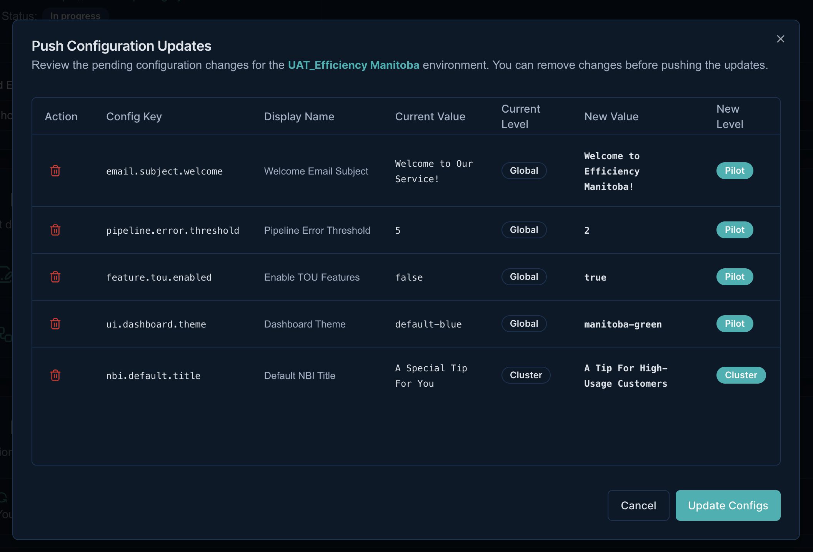

# Project Management

!!! abstract "Product Specification"
    - [DETO Vision](https://bidgely.atlassian.net/wiki/pages/viewpage.action?pageId=931495969)
    - [Project & Environment Creation](https://bidgely.atlassian.net/wiki/pages/viewpage.action?pageId=847642630)
    - [Project Details](https://bidgely.atlassian.net/wiki/pages/viewpage.action?pageId=853245955)

## Overview
Project Management enables true self-serve, enterprise-grade provisioning of utility pilot projects. By combining infrastructure provisioning, identity access management, and dataset initialization into a single seamless flow, Delivery Engineering teams or Customer Admins can set up an entire project—including development, UAT, and production environments—with "one click." 

This unified Delivery Console workflow eliminates the need for manual hand-offs between separate infrastructure, application, and content operations teams, fulfilling the DETO Vision of deploying a client-ready workspace in hours instead of weeks.

## Key Capabilities
- **1-Click Infrastructure Provisioning:** Automatically bootstrap databases, API gateways, CMS instances, and backend services (like Pingpong).
- **Environment Mapping:** Link the same strategic project across DEV, UAT, and PROD using a centralized Pilot ID mechanism.
- **Dynamic Utility Configuration:** Pre-populate utility contexts (e.g., fuel types, customer profiles) so the application is interaction-ready on Day 1.
- **Automated Configuration Ingestion:** Ingest data mappings and backend configuration settings dynamically during the project boot phase.
- **Config Push Workflows:** Push updated core attributes and pipeline components directly to a matched environment.

## User Guide

### 1. Creating a New Project Workspace
1. Navigate to the **Delivery Console Dashboard**.
2. Click **Create New Project**.
3. In the wizard, provide the core project metadata: **Project Name**, **Pilot ID**, **Country**, and **Customer Type** (e.g., SMB vs Residential).
4. Configure the **Fuel Type** and **Meter Types** applicable to this utility deployment.

### 2. Linking and Provisioning Environments
1. With the core Project created, navigate to the **Environments** tab.
2. Click **Add Environment**.
3. Select the target tier (e.g., *Dev*, *UAT*, or *Prod*).
4. Provide the environment details, linking it securely to the root Pilot ID.
5. Click **Provision**. Background workers (integrated with the Environment Manager) will begin spinning up isolated infrastructure instances.

### 3. Setting Up Ingestion Targets
1. Once your environment reaches the *Running* state, open the **Project Details** screen.
2. Select the matched environment and open the **Ingestion Configs** panel.
3. Configure your automated data connectors.
4. Save the configuration to ensure the Pingpong data pipelines ingest raw datasets correctly for this specific deployment.

## Configuration Options
- **Template Inheritance:** Base project settings on existing robust templates to accelerate setup times for common industry configurations.
- **Role-Based Provisioning:** Limit environment creation or PROD linkage strictly to senior TPM or Delivery Engineer roles.

## Related Features
- [Environment Management](environment-management.md)
- [Content Management](content-management.md)
- [Data Migration](data-migration.md)
