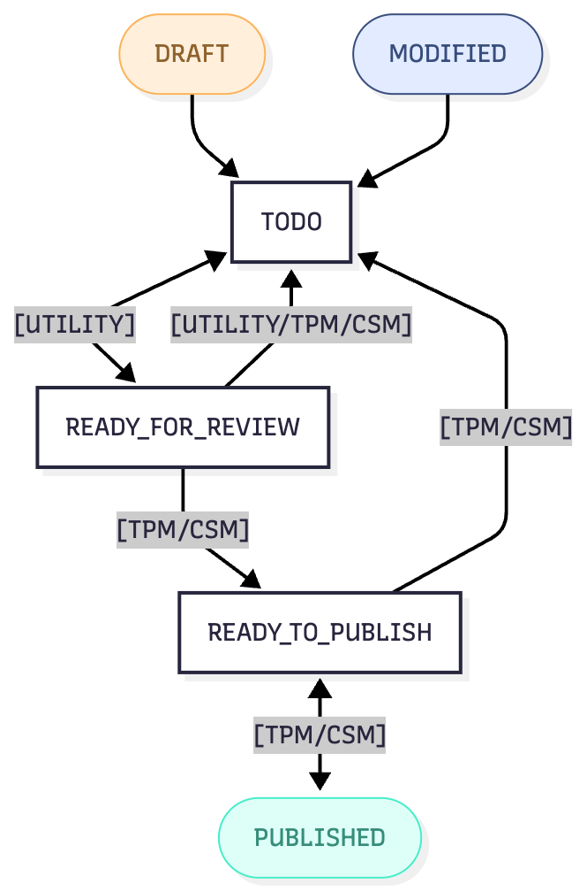

# Recommendations

!!! abstract "Confluence"
\- [Confluence 1](https://bidgely.atlassian.net/wiki/pages/viewpage.action?pageId=815431723)
\- [Confluence 2](https://bidgely.atlassian.net/wiki/pages/viewpage.action?pageId=633110556)

## Overview

The **Recommendations** area in DETO is where teams create, review, update, and publish recommendation content for a specific **Project** (pilot). It gives utility teams and internal stakeholders a structured way to manage recommendation content without relying on spreadsheets, file sharing, or release cycles. Each pilot keeps its own isolated content, so changes in one project do not affect another.

This area is designed for controlled content operations. You can create new recommendations, edit existing ones, manage draft and published versions separately, collaborate through comments, work across supported locales, and configure recommendation score thresholds. The workflow is role-based, so what you can see and do depends on your permissions and the current status of the recommendation.

Recommendations also follow a governed lifecycle. In practice, this means you can safely make changes in a working version while the live **Published** version remains unchanged until an authorized user publishes the update. This helps teams review content, validate it, and release it with less risk.

## Key Capabilities

## Key Capabilities

* View all recommendations for the selected **Project**
* See recommendation counts by status, including **Draft**, **Modified**, **Published**, and **Disabled**
* Create a new recommendation with structured content fields
* Edit recommendations in a dedicated editor
* Work with separate working and live versions of the same recommendation
* Filter and manage recommendation records in a table view
* Save changes or discard unsaved updates
* Navigate between recommendations using **Previous** and **Next**
* Add and review comments for collaboration and approval
* Manage localized content for supported locales
* Upload and crop recommendation images
* Configure **Score Thresholds** by category when you have permission
* View recommendation model details with region context when region-specific content is being used
* See recommendation counts for a project by content status

## User Guide

## User Guide

### Open and review recommendations for a project

1. Open **Projects** from the main menu.
2. Select the project you want to work in. You will land on that project’s **Content Dashboard**.
3. Open **Recommendations** from the dashboard.
4. Review the summary card at the top of the page. This shows counts such as **Total**, **Disabled**, **Draft**, **Modified**, and **Published**.
5. Use the recommendations table to browse available items for the selected project.
6. If needed, use table filters to narrow the list by status or recommendation attributes.
7. Click **Refresh** to reload the list when you want the latest saved content. If you have unsaved table changes, refresh may be unavailable until those changes are resolved.

### Create a new recommendation

1. In **Recommendations**, click **Add New**.
2. Enter the core recommendation details, such as title, description, category, and other required business fields.
3. Choose the appropriate targeting and delivery settings, such as fuel type, channel options, and any other visible recommendation attributes available in the form.
4. Add images where needed. You can either paste an **Image URL** and click **Load URL**, or click **Upload File** to add an image from your computer.
5. If the image needs adjustment, use the crop step to fit the required dimensions before continuing.
6. If you want to reuse existing content, use the copy-from-existing option in the form to start from another recommendation version instead of building from scratch.
7. Save your work. A new recommendation is typically created as **Draft** and then opens in the edit view for further updates and workflow actions.

### Edit a recommendation and manage versions

1. From the recommendations table, open the recommendation you want to update.
2. At the top of the editor, confirm the **Recommendation ID** and current status chip, such as **Draft**, **Modified**, or **Published**.
3. If the recommendation has both a working version and a live version, use the tabs to switch between **Draft** or **Modified** and **Published**.
4. Update the content fields you need to change. Depending on the recommendation state and your role, some versions may be read-only.
5. If you switch tabs while you still have unsaved changes, review the **Unsaved Changes** prompt carefully before continuing.
6. Use **Previous** or **Next** to move through recommendations without returning to the table.
7. Save your updates. For a new item, the recommendation remains **Draft**. For a previously published item, your saved changes become **Modified** until they are published.
8. If you decide not to keep your changes, use the available discard action to revert the working copy.

### Review recommendation counts by status

1. Open the project you want to review.
2. Go to **Recommendations**.
3. Use the visible status views, filters, or summary counts to focus on the recommendation state you want to review.
4. Check the count shown for that status to understand how many recommendations currently match it.
5. Refresh the page or list if recent saves, publishes, or status changes are not yet reflected in what you are viewing.

### Work with region-specific recommendation context

1. Open the project and navigate to the recommendation content or model view used by your team.
2. If your workflow includes region-specific recommendation handling, confirm that you are reviewing the correct region context for the project.
3. Review recommendation content carefully, especially when comparing outputs across regions, because the region context may affect how recommendation data is interpreted downstream.
4. If you are unsure which region should apply, confirm the expected setup with your project or implementation team before making content decisions.

### Collaborate with comments and review status

1. Open a recommendation in the edit view.
2. Click the comments icon near the top of the page. The badge shows how many comments already exist.
3. Review the recommendation summary in the comments view so you can confirm you are discussing the correct item.
4. Add comments to capture review feedback, questions, or approval notes.
5. Return to the recommendation editor and make any requested updates.
6. Move the recommendation through the review workflow according to your role. Common workflow states include **TODO**, **READY\_FOR\_REVIEW**, and **READY\_TO\_PUBLISH**.
7. If you are authorized to publish, publish the recommendation when review is complete. If you are not authorized, submit it for the next reviewer instead.

### Configure recommendation score thresholds

1. Open the project you want to manage.
2. Go to **Recommendation Score Thresholds**.
3. Review the guidance at the top of the page. This explains that **Max** and **Min** values help create a score gradient across recommendations in the same category.
4. In the table, review each category’s **Category Name**, **Max**, **Min**, **Number of Recos**, and calculated **Step**.
5. Edit the **Max** and **Min** values for the categories you want to adjust.
6. Check that each value is valid. Values must stay between 0 and 1, and **Min** must be lower than **Max**.
7. Click **Save all** to keep your changes.
8. If you want to abandon pending edits, click **Discard all** and confirm the prompt.

## Configuration Options

## Configuration Options

Recommendations are managed within the currently selected **Project**, so project selection is the first level of configuration.

Common user-visible configuration includes:

* **Default Locale** and **Supported Locales** for localized recommendation content
* Recommendation content fields such as title, description, call-to-action text, links, images, and channel settings
* Recommendation metadata such as category and targeting-related attributes
* **Score Thresholds** by category
* Workflow status progression, based on role and current recommendation state
* Region context, where applicable, for recommendation model views and downstream recommendation handling

Permissions affect what actions are available. For example:

* Utility users can typically create, edit, save, discard, submit for review, and delete recommendations in assigned projects
* PM, TPM, and CSM users can typically do all of the above and also publish, unpublish, and manage broader recommendation configuration
* Some areas, such as **Reco Exclusions**, project profiles, or score settings, may be hidden if your role does not allow access

If an option is not visible, it is usually controlled by your assigned role or project access.

## Related Features

* [Project Management](project-management.md)
* [Content Management](content-management.md)
* [Survey Builder](survey-builder.md)
* [CX Visual Editor](cx-visual-editor.md)
