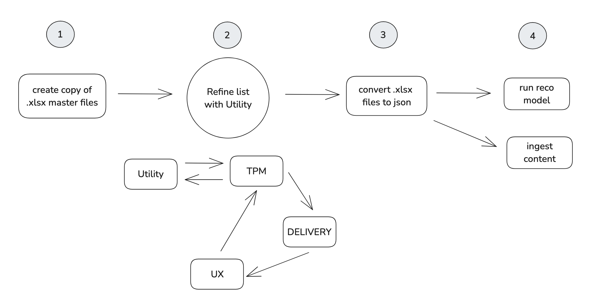
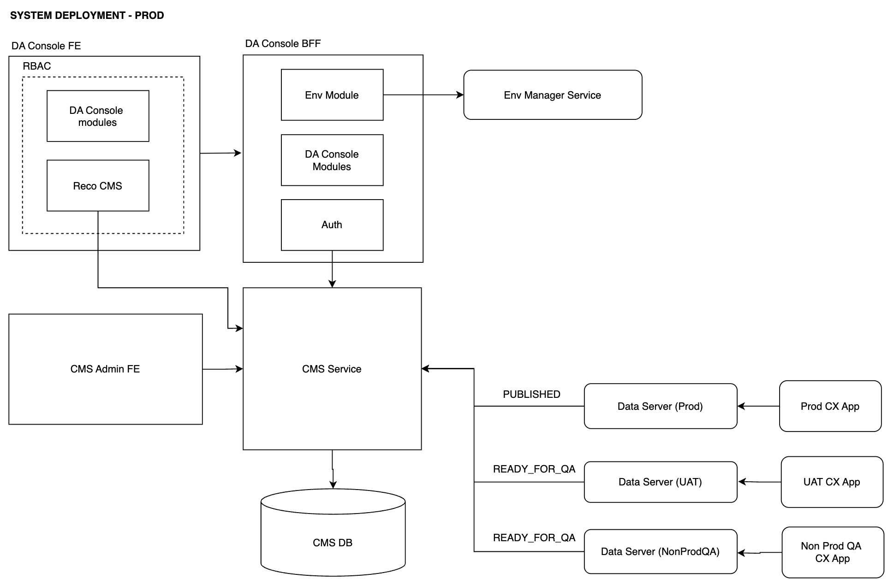

# Recommendations

!!! abstract "Product Specification"
    - [Product Spec 1](https://bidgely.atlassian.net/wiki/pages/viewpage.action?pageId=815431723)
    - [Product Spec 2](https://bidgely.atlassian.net/wiki/pages/viewpage.action?pageId=633110556)

## Overview
Recommendations are personalized, actionable insights generated by Bidgely's analytical engine to help utility customers manage energy consumption. The Content Management System (CMS) enables administrators to create, categorize, and deploy these recommendations dynamically without requiring engineering releases.

## Key Capabilities
- **Content Authoring & Personalization:** Rich text editing for localized recommendation titles, descriptions, and actionable steps.
- **Audience Targeting:** Link recommendations specifically to particular user segments, fuel types (Electric vs. Gas), or billing contexts.
- **Multi-channel Delivery:** Author recommendations once and distribute them consistently across web dashboards, mobile apps, and paper reports.
- **Workflow & Lifecycle Management:** Draft, review, approve, and publish workflows ensuring content governance before it reaches end-users.
- **Version Control & Rollbacks:** Keep track of historical changes to content and revert if necessary.

## User Guide

### 1. Creating a New Recommendation
1. Log in to the CMS Dashboard and navigate to the **Recommendations** section under Content Tools.
2. Click the **Create Recommendation** button.
3. Provide the core metadata such as the unique Recommendation ID, Category (e.g., *Heating*, *Cooling*, *General Efficiency*), and Status.

### 2. Authoring Content
1. Within the **Drafting** phase, use the rich text editor to author the recommendation title, body text, and dynamic placeholders (e.g., `{{user_savings_amount}}`).
2. Attach necessary media or icons to enhance the visual presentation.
3. Configure **Localization** rules if the campaign targets multiple regions (e.g., adding French/Spanish translations).

### 3. Review and Publish
1. Switch the recommendation status to **In Review**.
2. Authorized approvers can preview the content exactly as it will appear in the customer portals via the **Preview Engine**.
3. Once approved, click **Publish** to immediately push the new insight to the production API edge nodes.

## Configuration Options
- **Strict Review Rules:** Administrators can configure the workflow to require two-stage approvals for critical notification changes.
- **Fallback Content:** Configure default recommendations to display if customer-specific intelligence is unavailable.

## Related Features
- [Content Management](content-management.md)
- [CX Visual Editor](cx-visual-editor.md)
- [Project Management](project-management.md)
