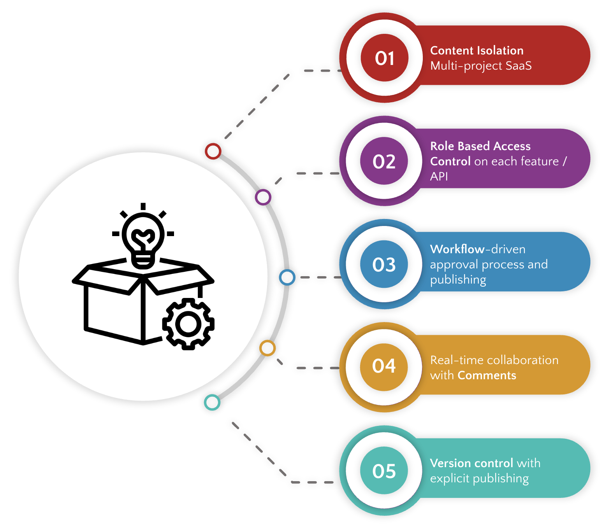
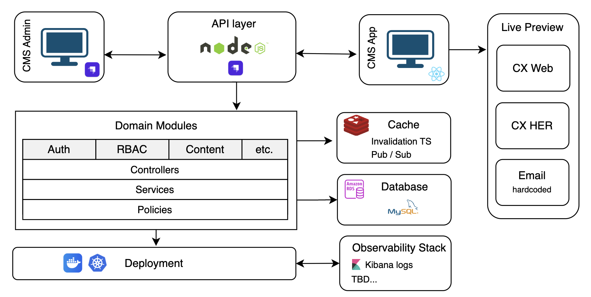

# Recommendations

!!! abstract "Confluence"
\- [Confluence 1](https://bidgely.atlassian.net/wiki/pages/viewpage.action?pageId=815431723)
\- [Confluence 2](https://bidgely.atlassian.net/wiki/pages/viewpage.action?pageId=633110556)

## Overview

The **Recommendations** section of the DETO dashboard lets utilities create, edit, and publish content that will appear in the customer experience (CX) product.  It is a self‑serve CMS that keeps all recommendation data in a single, versioned space.  Product managers, customer‑success managers, and enterprise admins can use it to target specific customer segments, set scoring thresholds, and manage localization without touching code.

## Key Capabilities

## Key Capabilities

* **Create new recommendations** with title, description, media, and targeting rules.
* **Edit existing recommendations** in a WYSIWYG preview mode.
* **Publish, verify, and approve** recommendations through a clear status workflow.
* **Bulk actions** – publish, delete, or clone many items at once.
* **Localization** – edit content for each supported language.
* **Score thresholds** – set ranking logic for recommendation categories.
* **Comments & collaboration** – threaded discussion attached to each recommendation.
* **Version control** – separate draft and published copies with audit trail.
* **Filtering & sorting** – quick search and column filters in the list view.
* **Image upload & cropping** – add or replace media with built‑in editor.
* **Role‑based permissions** – control who can create, edit, or publish.
* **Channel‑based filtering** – retrieve recommendations by channel via the API.

## User Guide

### Create a New Recommendation

1. Open the **Recommendations** page from the CMS area.
2. Click **Add New** (the **+** button).
3. In the wizard, fill in **Title** and **Description**.
4. Upload an image or video in the **Media** section.
5. Choose a **Category** and set **Targeting Rules** (e.g., fuel type, appliance type).
6. Set **Score Thresholds** if needed.
7. Click **Save Draft** to keep a copy or **Submit for Verification** to move to the next stage.
8. 

### Edit an Existing Recommendation

1. From the list, select the recommendation you want to change.
2. Click the **Edit** icon (pencil).
3. The editor opens with a **Live Preview** pane that shows how the recommendation will look in the CX product.
4. Modify any field – title, description, media, or targeting.
5. Use the **Save Draft** button to keep changes or **Publish** to make them live.
6. If you need to revert, click **Discard** to restore the last published version.
7. 

### Manage Recommendation Status

1. In the list view, each recommendation shows a status badge: **Draft**, **Modified**, **Verification**, or **Published**.
2. Click **Submit for Verification** to move a draft into the verification stage.
3. A reviewer (PM or CSM) can add comments, approve, or reject.
4. Approved items become **Published** and appear in the CX product.
5. The status bar at the top of the editor shows the current stage and available actions.
6. 

## Configuration Options

* **Pilot Projects** – each pilot has its own set of recommendations, locales, and scoring rules.
* **Locale Settings** – choose default and supported languages for the pilot.
* **Score Thresholds** – set per‑category min/max values in the **Score Thresholds** page.
* **Permissions** – CMS admins assign users to pilots and grant create/edit/publish rights.
* **Audit Trail** – automatically recorded for every status change, comment, and edit.

## Related Features

* [Survey Builder](survey-builder.md) – design surveys that can be linked to recommendations.
* [CX Visual Editor](cx-visual-editor.md) – preview how recommendations appear in the customer portal.
* [Config Registry](config-registry.md) – manage global configuration values that affect recommendation logic.
* [Workflow Engine](workflow-engine.md) – orchestrate multi‑step approval processes for content.
