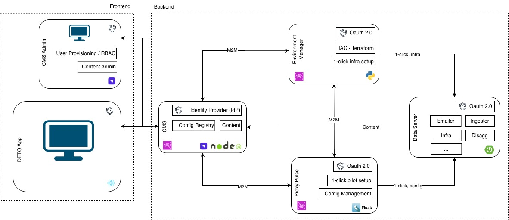

# Architecture

!!! abstract "Confluence"
    - [Source 1](https://bidgely.atlassian.net/wiki/pages/viewpage.action?pageId=1339392001)

## Overview

DETO architecture is built around three core services that work together to make project delivery faster and more consistent:

- **ProxyPulse** coordinates project setup
- **Env-Manager** provisions environments and deploys the required components
- **CMS** manages both user roles in DETO and non-code content used in CX

This architecture is designed to reduce manual engineering and DevOps work, especially when teams need to launch new projects, pilots, or sub-environments.

## Key points

- Project provisioning is **centralized and automated**, rather than handled through manual setup.
- **ProxyPulse** is the orchestration layer for project provisioning, pilot configuration, and business rules.
- **Env-Manager** provides **one-click**, end-to-end environment setup on **AWS** and **EKS**.
- **CMS** has a dual role:
  - **Identity Provider** for managing user roles in **DETO**
  - **Content repository** for non-code assets in **CX**
- Customer-facing content can be updated in real time through CMS **without engineering deployments**.
- The architecture is intended to improve consistency across customer environments and speed up onboarding for pilots and sub-environments.

## How teams use this

### Provisioning projects

Project setup is coordinated through **ProxyPulse**. It works with **Env-Manager** and **CMS** to automate setup steps that would otherwise require manual engineering effort.

In practice, this means:
- project provisioning is managed through a central orchestration layer
- pilot configurations and business rules are handled in one place
- setup stays consistent across customer environments

### Launching pilots and sub-environments

For new pilots and sub-environments, **Env-Manager** handles the actual provisioning work. It provides one-click, end-to-end setup and deploys the required:
- backend services
- databases
- front-end components

This is the main mechanism used to accelerate onboarding.

### Managing roles and customer-facing content

**CMS** supports two important admin-facing needs:

- **User role management in DETO**
- **Non-code content management for CX**

The content stored in CMS includes items such as:
- appliances
- home profiles
- recommendations
- surveys
- media

A key architectural benefit is that business users can update this customer-facing content without waiting for an engineering deployment.

## Service responsibilities

### ProxyPulse

ProxyPulse is the configuration and orchestration layer for provisioning projects. It provides a unified interface for managing:
- pilot configurations
- business rules

It works with the other core services rather than provisioning everything by itself.

### Env-Manager

Env-Manager is the centralized automation service for environment creation. It is responsible for one-click provisioning and end-to-end setup on:
- AWS
- EKS

Its role is to stand up the environment and deploy the technical components needed for a project.

### CMS

CMS is the central identity and content hub.

Its two roles are:
1. **Identity Provider** for DETO user roles
2. **Content repository** for non-code assets used in CX

This separation between code deployment and content updates is an important part of the overall architecture.

## Cross-system flow

At a high level:

1. **ProxyPulse** coordinates project provisioning
2. **Env-Manager** performs environment setup and deployment
3. **CMS** provides identity and content inputs used by DETO and end-user applications

The page does not define the detailed runtime sequence, but it clearly establishes these responsibilities:
- **project setup** is coordinated through ProxyPulse
- **environment provisioning** is executed by Env-Manager
- **identity and non-code content** are centralized in CMS

## Dependency notes

Because these services work together, availability of each one matters:

- If **Env-Manager** is unavailable, environment provisioning is blocked.
- If **ProxyPulse** is unavailable, centralized project setup, pilot configuration, and business-rule management are impacted.
- If **CMS** is unavailable, role management and access to non-code content may be affected.

These are dependency implications from the architecture overview, not documented operational guarantees.

## Related documentation

- [Project Management](../features/project-management.md)
- [Recommendations](../features/recommendations.md)
- [Survey Builder](../features/survey-builder.md)