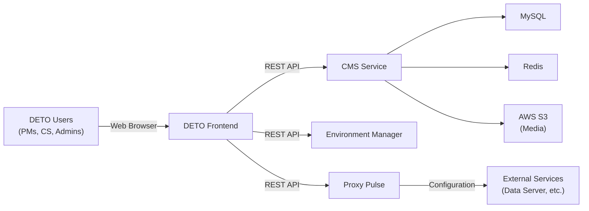

# Architecture

## System Overview

## Components

### DETO Frontend
The primary user interface — a web application that provides all DETO capabilities. Accessed via browser, no installation required.

### CMS Service
The Content Management System that powers recommendations, surveys, profiles, and content management. Stores data in MySQL with Redis caching and AWS S3 for media.

### Environment Manager
Provisions and manages deployment environments. Handles infrastructure setup for new utility projects. *(Coming soon)*

### Proxy Pulse
Manages configuration propagation and project orchestration across environments. *(Coming soon)*

## Technical deep dive

For schema-level detail (content types, RBAC, workflows) and component-specific notes, see **[Technical reference](technical/cms/index.md)** under this section.

## External Integrations

DETO's CMS exposes APIs that are consumed by other Bidgely services:

- **Data Server** — Fetches recommendation models, survey templates, and configuration data
- **Customer-Facing Apps** — Retrieve content and configuration for end-user experiences
