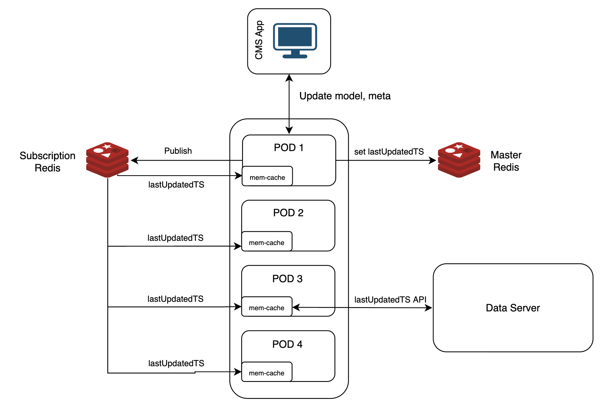
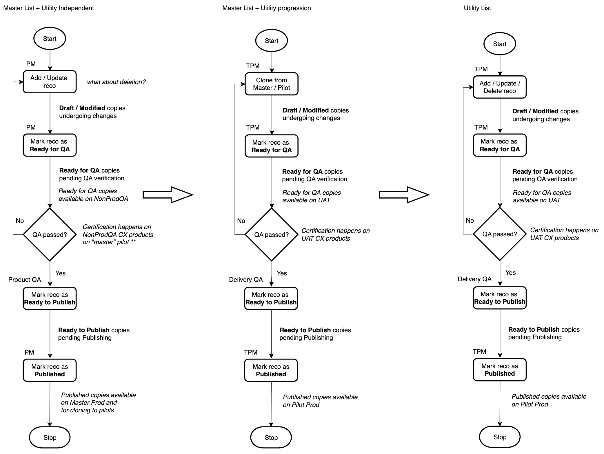

# CMS

!!! abstract "Confluence"
    - [Source 1](https://bidgely.atlassian.net/wiki/pages/viewpage.action?pageId=633110556)

## Overview

CMS is a content‑management sub‑module of the Delivery Console that lets utility teams author, review, and publish the pages, surveys, and pilot materials that appear in recommendations and other delivery workflows. It shares the same authentication and data layers as the rest of DETO, and it enforces role‑based access control so that only authorized users can edit or publish content.

## Key points

- CMS lives inside the Delivery Console and uses the same user interface shell.  
- Content is cached in a subscription‑aware Redis instance for fast, tenant‑isolated reads.  
- The authoritative copy of content is stored in the core data server.  
- A visual content‑status workflow tracks items from draft through review to published.  
- Role‑based access control (RBAC) governs who can edit, review, or publish.

## How teams use this

Project managers and content editors create new pages, attach assets, and set publication dates in CMS. Once a piece of content is approved, the “Publish via CMS” button moves it from draft to published state, after which it is written to the data server and becomes visible to end‑users through the Delivery Console.

## Technical specification (DEV) — System Design

The following diagram shows how CMS fits into the overall Delivery Console architecture, how it interacts with Redis for subscription‑level caching, and how it writes to the core data server. The diagram also highlights the RBAC workflow that governs user permissions.

CMS is a sub‑module of the Delivery Console, sharing the same user interface shell and authentication mechanisms.

Content is cached in a subscription‑aware Redis instance to support multi‑tenant isolation and fast read access.

When content is created or updated, it is written to the core data server, which stores the authoritative copy.

The CMS UI provides a “Publish via CMS” button that triggers the workflow to move content from draft to published state.

The content status workflow is visualized in a diagram that shows the stages a piece of content passes through before it becomes live.

Role‑based access control (RBAC) is enforced through a workflow that checks user permissions before allowing actions such as edit, review, or publish.

## Available Images

- `../../../assets/images/633110556-Screenshot-202025-08-25-20at-2012.07.30-E2-80-AFPM.png` — System Architecture  
- `../../../assets/images/633110556-Screenshot-202025-08-19-20at-204.24.52-E2-80-AFPM.png` — CMS as a sub-module of Delivery Console  
- `../../../assets/images/633110556-Screenshot-202025-08-25-20at-201.32.45-E2-80-AFPM.png` — Subscription Redis  
- `../../../assets/images/633110556-Screenshot-202025-08-25-20at-2012.12.40-E2-80-AFPM.png` — Current (Data Server)  
- `../../../assets/images/633110556-Screenshot-202025-08-25-20at-2012.10.33-E2-80-AFPM.png` — via CMS  
- `../../../assets/images/633110556-Mermaid-20Chart-20-20Create-20complex-20visual-20diagrams-20with-20text.-2025-10.png` — Content Status Workflow  
- `../../../assets/images/633110556-Screenshot-202025-08-21-20at-203.44.10-E2-80-AFPM.png` — RBAC workflow