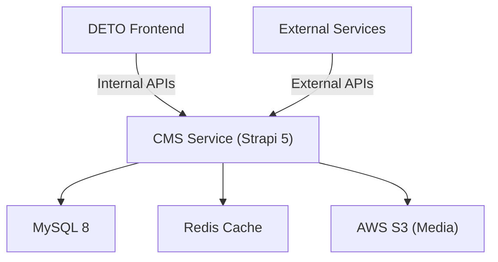

# CMS Service — Technical Overview

The CMS (Content Management System) is the backend service that powers DETO's content and configuration capabilities. Built on Strapi 5 with MySQL, Redis, and AWS S3.

## Architecture

## Domain Model

The CMS organizes data into domains, each with its own content types, routes, and business logic:

| Domain | Content Types | Description |
|--------|--------------|-------------|
| Utility | Utility, Appliance Profile, Home Profile, Reco Score | Pilot project configuration |
| Recommendation | Recommendation | Energy recommendations with i18n |
| Survey | Survey Category, Question, Template | Customer surveys |
| Config Registry | Config, Lookup, Lookup Type, Template | Application configuration |
| Data Scenario | Data Scenario, Payload | Test/demo data |
| Workflow | Feature Workflow, System Node, Edge, Position | Visual workflows |
| Migration | Job Manifest | Data migration jobs |
| Content | Appliance, Appliance Category, Color, Home Profile Attribute | Master data |

## Technical Details

- [Data Models](data-models.md) — Complete schema reference for all content types
- [RBAC & Permissions](rbac.md) — Role-based access control and policies
- [Workflows](workflows.md) — Content review state machines
