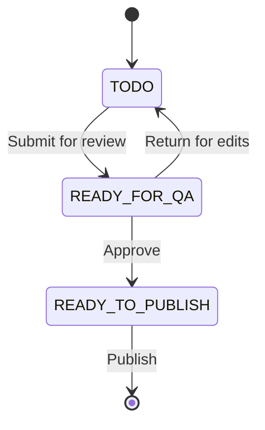
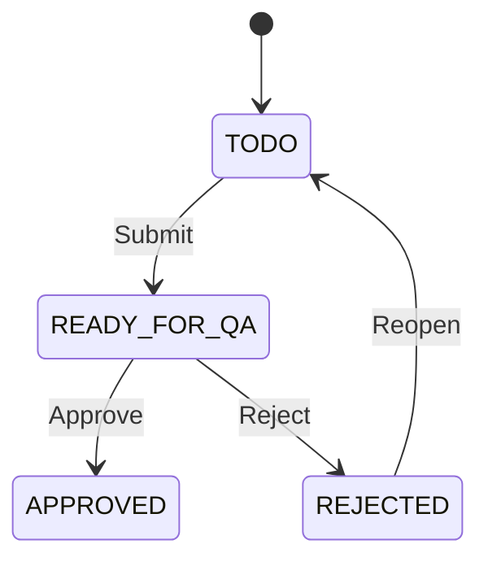

# Content Workflows

The CMS uses state machines to manage content lifecycle — from creation through review to publication.

## Recommendation Review Workflow

### Actions by Role

| State | Content Creator | Content Publisher |
|-------|----------------|-------------------|
| TODO | Save, Edit | Save, Edit |
| READY_FOR_QA | (read only) | Approve, Return |
| READY_TO_PUBLISH | (read only) | Publish |

## Draft/Publish Versioning

Content types that support draft/publish maintain two versions:

- **Draft** — Working version being edited
- **Published** — Live version visible to external consumers

Changes to a published item create a "Modified" state until explicitly published or discarded.

## Config Registry Workflow

Configurations follow an approval workflow:

